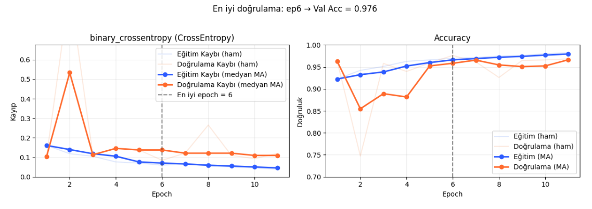
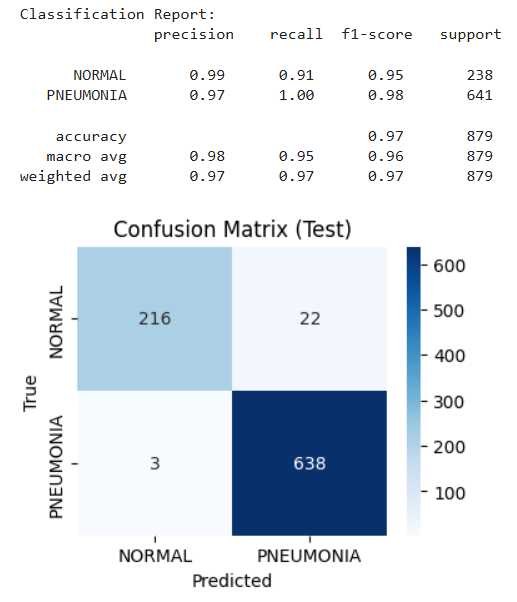
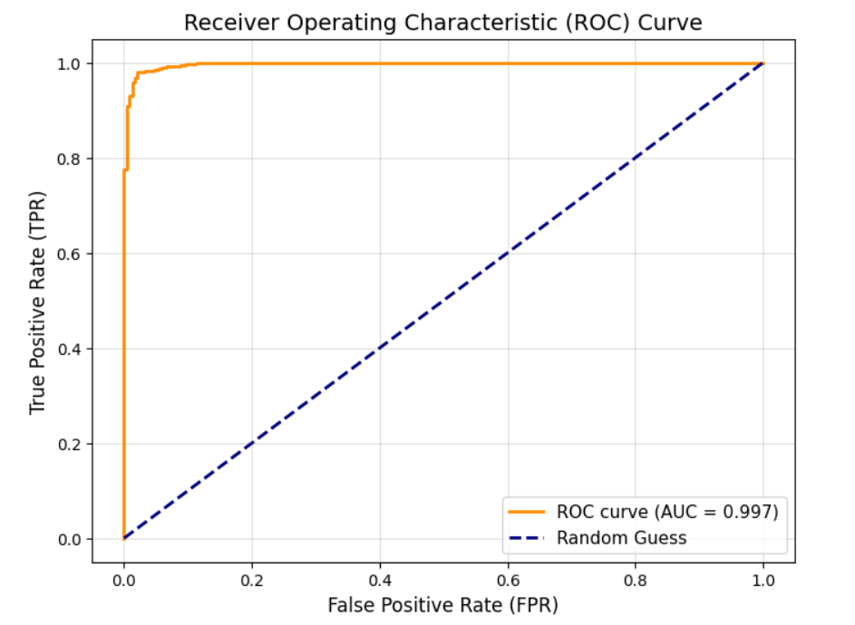
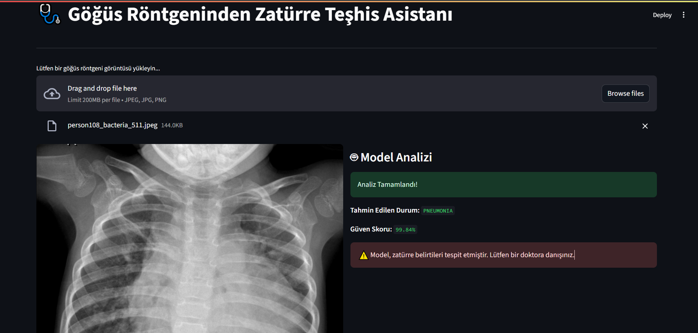
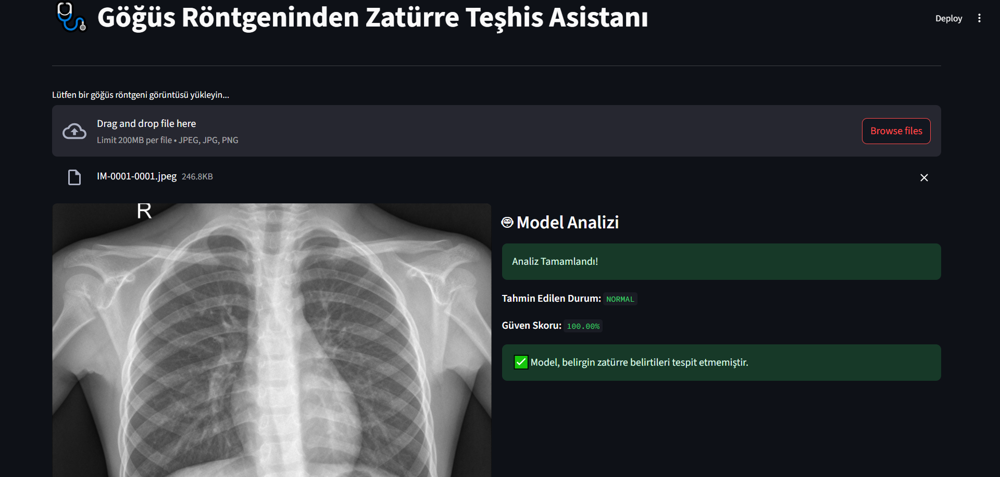

# DERİN ÖĞRENME İLE ZATÜRRE TEŞHİSİ
## Giriş

Pnömoni, pediatrik hastalarda erken ve doğru teşhis gerektiren kritik bir solunum yolu enfeksiyonu olup, bu çalışma **göğüs röntgeni görüntülerinin derin öğrenme yöntemleriyle sınıflandırılmasına** odaklanmaktadır. Çalışmada kullanılan veri seti, [**pediatric-pneumonia-detection**](https://www.kaggle.com/datasets/andrewmvd/pediatric-pneumonia-chest-xray), farklı sınıflara (**NORMAL** ve **PNEUMONIA**) ait göğüs röntgeni görüntülerinden oluşmaktadır. 

Çalışmanın temel amacı, derin öğrenme yöntemleri kullanılarak pediatrik pnömoni teşhisini otomatikleştiren bir model geliştirmek ve bu modeli kullanıcı dostu bir **Streamlit** arayüzü üzerinden erişilebilir hale getirmektir.

Bu kapsamda, **ResNet18** mimarisi üzerine kurulu bir **Evrişimli Sinir Ağı (CNN)** tercih edilmiştir. Modelin daha hızlı ve etkili bir şekilde öğrenmesini sağlamak için **transfer öğrenmesi** uygulanmış, **ImageNet** üzerinde önceden eğitilmiş ağırlıklar yeniden uyarlanmıştır. Sınıf dengesizliği problemine karşı, **ağırlıklandırılmış Cross-Entropy kaybı** ve **WeightedRandomSampler** teknikleri kullanılmıştır.

Veri hazırlama aşamasında:

- **Katmanlı veri bölümlendirme (stratified split)** ile eğitim, doğrulama ve test setleri oluşturulmuş,
- Bozuk ve hatalı görüntüler temizlenmiştir,
- Veri artırma (**data augmentation**) yöntemleri ile modelin genelleme kabiliyeti geliştirilmiştir.

Eğitim sürecinde:

- **AdamW optimizatörü**, 
- **L2 düzenlileştirme**, 
- **Dropout**, 
- **Dinamik öğrenme oranı** ve 
- **Erken durdurma stratejileri** uygulanarak aşırı öğrenme önlenmeye çalışılmıştır.

Modelin performansı, **karmaşıklık matrisi**, **precision**, **recall**, **F1-skoru** gibi sınıflandırma metrikleri ile değerlendirilmiş; ayrıca **ROC-AUC** analizi yapılmıştır. Yorumlanabilirlik için **Grad-CAM** tekniği kullanılarak modelin karar verirken odaklandığı bölgeler görselleştirilmiştir.

Son aşamada, eğitilen model **Streamlit tabanlı bir web arayüzüne entegre** edilmiştir. Bu arayüz, kullanıcıların göğüs röntgeni yükleyerek pnömoni teşhisi hakkında hızlı ve interaktif geri bildirim alabilmesine olanak tanımaktadır.

## Metrikler

Geliştirilen modelin performansı, birbiriyle entegre iki temel aşamada titizlikle incelenmiştir: öncelikle **eğitim sırasındaki öğrenme dinamikleri** ve ardından modelin daha önce hiç karşılaşmadığı, tamamen ‘kör’ bir **veri seti** üzerindeki nihai test performansı. Elde edilen sonuçlar, modelin hedeflenen görevi olağanüstü bir başarıyla yerine getirdiğini ve pratik uygulamalar için büyük bir potansiyel taşıdığını kanıtlamaktadır.

### 1. Eğitim Sürecinin Analizi

Modelin eğitim süreci, **Kayıp (Loss)** ve **Doğruluk (Accuracy)** grafikleri aracılığıyla yakından izlenmiştir. Bu grafikler, modelin öğrenme sürecinin ne kadar sağlıklı ilerlediğini gösterir:

- **Kararlı Öğrenme ve Genelleme Kabiliyeti:** Grafiklerde, hem eğitim hem de doğrulama metriklerinin zamanla olumlu yönde ve birbirine paralel şekilde ilerlediği net bir şekilde görülmektedir. Eğitim ve doğrulama eğrileri arasındaki bu uyum, modelin veriyi ezberlemediğini, aksine altında yatan temel desenleri öğrendiğini gösteren en önemli işaretlerden biridir. Bu durum, projede uygulanan veri artırma ve düzenlileştirme stratejilerinin ne kadar etkili olduğunun bir kanıtıdır.  

- **Optimum Noktanın Tespiti:** Model, en yüksek doğrulama başarısına (%97.6) **6. epoch**'ta ulaşmıştır. Kurulan **Erken Durdurma (Early Stopping)** mekanizması, bu zirve noktasını başarıyla tespit ederek eğitimi sonlandırmıştır. Bu akıllıca yaklaşım, hem en ideal modeli güvence altına almış hem de gereksiz hesaplama maliyetinden kaçınmıştır.

---

### 2. Nihai Test Performansı

Eğitimin en verimli noktasında kaydedilen model, başarısını kanıtlamak üzere nihai sınavına, yani **Test Seti**'ne tabi tutulmuştur. Elde edilen sonuçlar, modelin sadece teoride değil, pratikte de ne kadar güçlü olduğunu gözler önüne sermektedir.

- **Genel Doğruluk ve Hata Analizi:** Model, test setinde **%97'lik etkileyici bir genel doğruluk** oranına ulaşmıştır. **Karmaşıklık Matrisi**'ne daha derinlemesine baktığımızda ise modelin hata yapma eğiliminin son derece düşük olduğunu görüyoruz. Özellikle tıbbi teşhiste en kritik hata türü olan **Yanlış Negatif (False Negative)**, yani zatürreli bir hastayı sağlıklı olarak etiketleme durumu, 641 vakadan sadece 3'ünde meydana gelmiştir.

- **Sınıflandırma Raporu:** Projenin en anlamlı sonucu, **PNÖMONİ sınıfı** için elde edilen **%100'lük Duyarlılık (Recall)** değeridir. Bu, tıbbi bir uygulama için hayal edilebilecek en iyi senaryodur. Modelimiz, test setindeki hiçbir zatürre vakasını gözden kaçırmamıştır. Bu bulgu, modelin bir güvenlik ağı olarak ne kadar güvenilir olabileceğinin altını çizmektedir. Aynı zamanda, **"NORMAL" etiketli tahminlerindeki %99'luk kesinlik (Precision)** oranı, sağlıklı bir bireye yanlış teşhis koyma riskinin ne kadar düşük olduğunu teyit eder.

---

### 3. Sınıfları Ayırt Etme Gücü

Son olarak, modelin iki sınıfı birbirinden ne kadar net bir şekilde ayırt edebildiğini ölçmek için **ROC eğrisi** ve **AUC skoru**na başvurduk.

- **AUC Skoru = 0.997:** Modelin elde ettiği 0.997'lik AUC skoru, mükemmele (1.0) çok yakındır. Bu, modelin bir **NORMAL** ve bir **PNÖMONİ** röntgeni arasından doğru olanı ne kadar isabetli bir şekilde 'daha riskli' olarak sıralayabildiğinin bir ölçüsüdür ve bu alandaki yeteneğinin neredeyse kusursuz olduğunu gösterir. ROC eğrisinin, grafiğin sol üst köşesine adeta yapışarak ilerlemesi, bu üstün ayırt etme gücünü görsel olarak da doğrulamaktadır.

## Ekler

Bu bölümde, projenin standart model eğitim sürecinin ötesine geçen, pratik uygulamaya yönelik ek çalışmaları ve altyapısal yetenekleri detaylandırılmaktadır.

---

### A. Uçtan Uca (End-to-End) Tahmin Süreci ve Streamlit ile Dağıtım (Deployment)

Proje, sadece eğitilmiş bir model dosyası (.pth) üretmekle kalmamış, bu modelin son kullanıcı tarafından kolayca erişilebilir ve kullanılabilir bir araca dönüştürülmesini de hedeflemiştir. Bu amaçla, proje reposunda yer alan **UI** klasörü içerisinde, **Streamlit** kütüphanesi kullanılarak interaktif bir web uygulaması geliştirilmiştir.

Bu uygulama, tam bir **uçtan uca (end-to-end) tahmin süreci** sunmaktadır:

1. **Kullanıcı Arayüzü:** Kullanıcı, web tarayıcısı üzerinden basit bir arayüzle karşılanır ve bir göğüs röntgeni dosyası yüklemesi istenir.  
2. **Otomatik Ön İşleme:** Yüklenen ham görüntü dosyası, arka planda otomatik olarak modelin beklediği formata dönüştürülür. Bu adımlar arasında **görüntünün yeniden boyutlandırılması, tensöre çevrilmesi ve normalizasyon** işlemleri yer alır.  
3. **Model Tahmini (Inference):** Ön işleme adımlarından geçen veri, daha önce eğitilmiş ve uygulamaya entegre edilmiş olan **ResNet18** modeline girdi olarak verilir. Model, saniyeler içinde görüntüyü analiz ederek bir tahmin üretir.  
4. **Sonuçların Sunulması:** Modelin teknik çıktısı (logits), kullanıcıların anlayabileceği anlamlı bilgilere dönüştürülür: **"NORMAL" veya "PNÖMONİ"** olarak bir teşhis etiketi ve bu tahmine olan güvenini gösteren bir yüzde skoru. Bu sonuçlar, anında web arayüzünde gösterilir.

Bu kesintisiz ve otomatikleştirilmiş akış sayesinde, geliştirilen model, teorik bir çalışmadan pratik kullanıma hazır, prototip bir **"Zatürre Teşhis Asistanı"** aracına başarıyla dönüştürülmüştür.

---

### B. GPU Desteği ve Esnek Çalışma Mimarisi

Proje altyapısı, hem modelin eğitimi hem de son kullanıcıya sunulması aşamaları için en verimli donanım kullanımını sağlayacak şekilde **esnek bir mimari** ile tasarlanmıştır:

- **Eğitimde GPU Hızlandırma:** Modelin eğitim süreci, modern derin öğrenme pratiklerine uygun olarak tamamen **GPU hızlandırmasını** desteklemektedir. Kod, `torch.cuda.is_available()` kontrolü ile sistemde uyumlu bir GPU varlığını tespit ederek, hem modelin kendisini hem de veri yığınlarını otomatik olarak GPU'ya taşır. Bu sayede, normalde saatler sürebilecek yoğun hesaplama gerektiren eğitim süreci, GPU'nun paralel işlem gücünden faydalanarak önemli ölçüde hızlandırılmıştır.  

- **Dağıtımda Esneklik (CPU/GPU Uyumluluğu):** Streamlit ile geliştirilen son kullanıcı uygulamasında, model `map_location='cpu'` parametresi ile kasıtlı olarak **CPU üzerinde çalışacak şekilde** yüklenmiştir. Bu bir kısıtlama değil, bilinçli bir tasarım tercihidir:  
  - **Maksimum Taşınabilirlik:** Bu tercih, uygulamanın özel bir ekran kartı (GPU) gerektirmeksizin, standart bir bilgisayar veya herhangi bir bulut sunucusu üzerinde sorunsuzca çalışabilmesini sağlar.  
  - **Verimlilik:** Tek bir görüntünün analizi (inference), eğitim kadar yoğun bir işlem değildir ve modern bir CPU tarafından kullanıcı deneyimini etkilemeyecek kadar hızlı (milisaniyeler içinde) gerçekleştirilebilir.

Bu hibrit yaklaşım, projenin en yoğun hesaplama gerektiren eğitim aşamasında GPU'nun gücünden tam olarak faydalanmasını, pratik dağıtım aşamasında ise **maliyet etkin ve yüksek uyumluluk** sunmasını sağlamaktadır. Altyapı, gerektiğinde tahmin sürecinin de GPU üzerinde çalıştırılmasına olanak tanıyacak şekilde esnektir.

## Sonuç ve Gelecek Çalışmalar

Gerçekleştirilen bu çalışmada, **pediatrik pnömoni teşhisini desteklemek amacıyla derin öğrenme tabanlı bir sınıflandırma modeli** geliştirilmiş ve **kullanıcı dostu bir Streamlit arayüzü** ile uygulamaya dönüştürülmüştür. Elde edilen sonuçlar, **yapay zekâ destekli yöntemlerin tıbbi görüntü analizinde klinik karar süreçlerine katkı sağlayabileceğini** ortaya koymaktadır.

Hedeflenen gelişim alanları şunlardır:

- **Daha geniş ve çeşitli veri setleri:** Farklı kaynaklardan elde edilmiş veri setleri ile modelin doğruluk ve genelleme yeteneğini artırmak.  
- **Gerçek zamanlı veri entegrasyonu:** Klinik ortamlarda kullanım senaryolarını güçlendirmek için canlı veri akışını entegre etmek.  
- **Alternatif derin öğrenme mimarileri:** Örneğin **EfficientNet** veya **Vision Transformer** gibi modelleri deneyerek performans karşılaştırmaları yapmak.  
- **İleri düzey yorumlanabilirlik:** Modelin karar mekanizmasını daha anlaşılır kılmak için Grad-CAM ve diğer yorumlanabilirlik tekniklerini geliştirmek.  
- **Geliştirilmiş kullanıcı arayüzü:** Mevcut Streamlit tabanlı arayüzü mobil cihazlar veya web tabanlı sağlık sistemlerine entegre edilebilir bir çözüm hâline getirmek.

Ayrıca, modelin yalnızca röntgen görüntülerine değil, **hastaya ait ek klinik veriler ve diğer yapay zekâ uygulamalarıyla entegre çalışarak** daha kapsamlı ve bütünsel bir **klinik karar destek sistemi** haline getirilmesi hedeflenmektedir.

## Linkler

- **Kaggle Çalışması:** [pediatric-pneumonia-detection](https://www.kaggle.com/code/gizemkoz/pediatric-pneumonia-detection)  
- **Proje Streamlit Arayüzü:** [Pneumonia Assistant](https://pneumonia-assistant.streamlit.app/)

